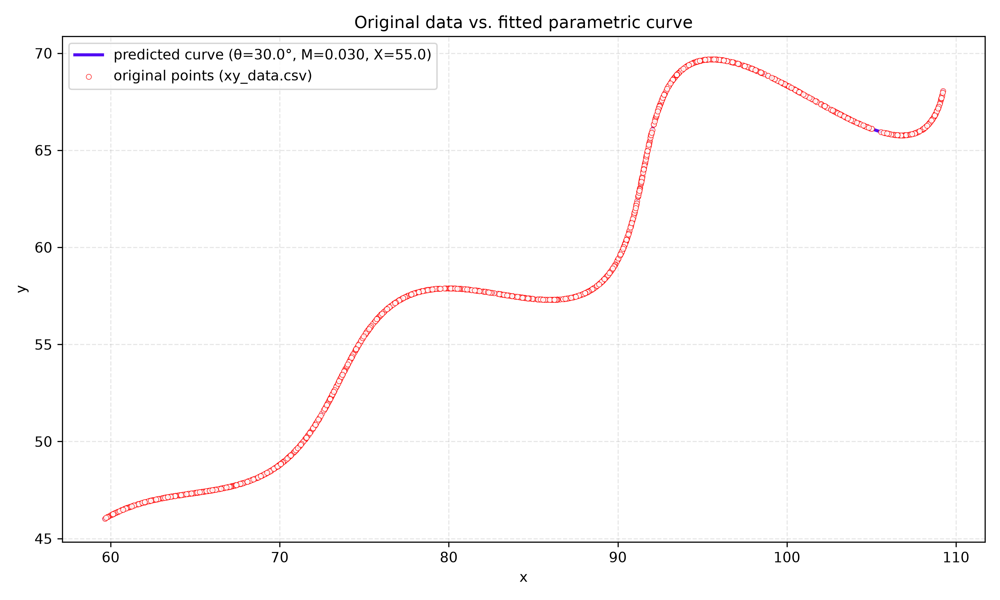

# Parametric Curve Parameter Estimation — FlamApp AI R&D Assignment

## Overview

This repo estimates three hidden parameters — **θ, M, X** — of a parametric curve, given only 1500 sampled `(x, y)` points (`xy_data.csv`).

**Explanation video:** https://drive.google.com/file/d/11wkDvWEU4s_wD3OHW2yjWvGlM6f08fsJ/view?usp=sharing

---

## Problem

```
x = t·cos(θ) − e^(M|t|)·sin(0.3t)·sin(θ) + X
y = 42 + t·sin(θ) + e^(M|t|)·sin(0.3t)·cos(θ)
```

- t ∈ [6, 60]
- θ ∈ (0°, 50°), M ∈ (−0.05, 0.05), X ∈ (0, 100)

---

## Mathematical Understanding

Instead of treating the equation as one large mathematical expression, it can be understood as four simple components.

### 1. Straight Line

```
x = t cosθ
y = t sinθ
```

generate a straight line.

- θ determines the direction of the line.
- t represents the distance travelled along that direction.

### 2. Sinusoidal Wave

```
sin(0.3t)
```

introduces oscillation around the straight line. Instead of travelling perfectly straight, the point moves left and right, producing a wave.

### 3. Exponential Envelope

```
e^(M|t|)
```

controls the amplitude of the wave.

- Positive M → wave grows larger
- Negative M → wave gradually shrinks

### 4. Horizontal Shift

```
X
```

shifts the complete curve horizontally without changing its shape.

---

## Why Differential Evolution?

The given equation contains

- Trigonometric functions
- Exponential functions
- Multiple interacting parameters

making it highly nonlinear. A direct analytical solution is difficult. Therefore, the problem is formulated as a **global optimization problem**, where the objective is to search for the values of θ, M and X that minimize the difference between the generated curve and the given data.

Differential Evolution is chosen because:

- It does not require gradient information.
- It performs global search efficiently.
- It works well on nonlinear optimization problems.
- It is less likely to get trapped in local minima compared to many gradient-based methods.

---

## Methodology

**Step 1 — Read Dataset**
The CSV file containing the sampled `(x, y)` coordinates is loaded.

**Step 2 — Generate Candidate Solutions**
Differential Evolution initializes a population of random candidate solutions. Each candidate represents:
```
Candidate = (θ, M, X)
```

**Step 3 — Generate Curve**
For every candidate, the parametric equations are evaluated over uniformly sampled values of `t`. This produces a predicted curve.

**Step 4 — Compute Error**
The generated curve is compared with the original curve using the **L1 distance**:
```
Loss = Σ ( |x_pred - x_actual| + |y_pred - y_actual| )
```
Lower error indicates a better candidate.

**Step 5 — Mutation**
Three random candidates `A`, `B`, `C` are selected. A new candidate is generated using:
```
New Candidate = A + F × (B − C)
```
where `B − C` provides the search direction and `F` is the mutation factor controlling step size.

**Step 6 — Crossover**
The mutated candidate is combined with the original candidate. This increases diversity while preserving useful information.

**Step 7 — Selection**
Both candidates are evaluated. The candidate with the lower objective function survives into the next generation.

**Step 8 — Repeat**
Mutation, crossover and selection continue for multiple generations until convergence. The candidate with the minimum error provides the estimated values of θ, M, X.

---

## Results

| Parameter | Value |
|---|---|
| θ | 30° (0.5236 rad) |
| M | 0.03 |
| X | 55 |

**L1 distance (original vs. predicted):** 0.000002



Full-size version: https://drive.google.com/file/d/1R7mRDXQ1-iF11P3orhNUzamVMYi4DIJm/view?usp=sharing

---

## Desmos

**Link:** https://www.desmos.com/calculator/nrvi7qh8re

```
\left(t*\cos(0.5236)-e^{0.03\left|t\right|}\cdot\sin(0.3t)\sin(0.5236)+55,42+t*\sin(0.5236)+e^{0.03\left|t\right|}\cdot\sin(0.3t)\cos(0.5236)\right)
```
Domain: `6 ≤ t ≤ 60`

---

## Files

```
.
├── xy_data.csv           # given dataset
├── curve.py          # loads data, runs DE, prints θ/M/X and L1, saves plot
├── curve_fit_result.png  # comparison graph
└── README.md
```

## Run it

```
pip install numpy pandas scipy matplotlib
python fit_curve.py
```

---

## References

Storn, R., & Price, K. (1997). Differential evolution — a simple and efficient heuristic for global optimization over continuous spaces. *Journal of Global Optimization*, 11(4), 341–359. https://doi.org/10.1023/A:1008202821328
